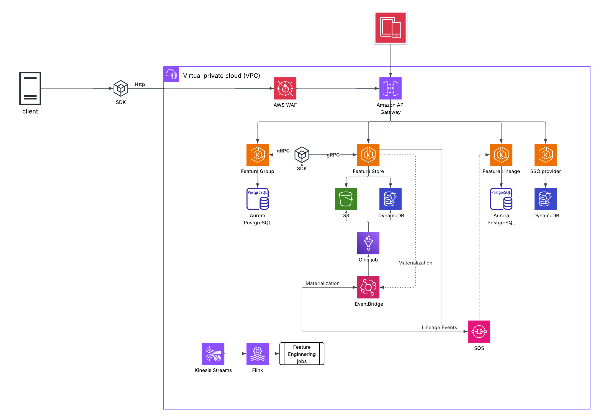
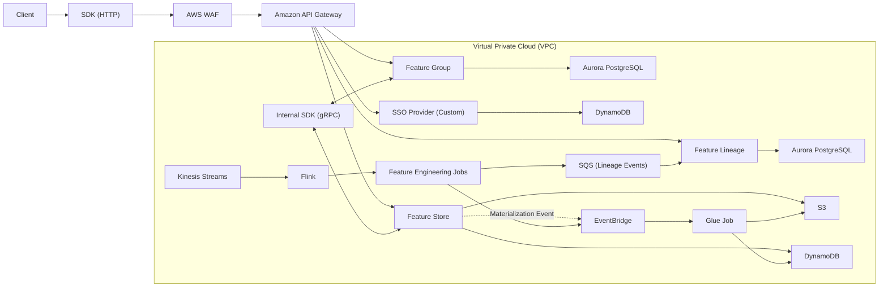

# Feature Store Monorepo

Monorepo for:
- Feature Group Service (PostgreSQL-backed metadata CRUD)
- Feature Store Service (offline S3 Delta + online DynamoDB + async materialization queue)
- Lineage Layer (OpenLineage event adapter -> Marquez)
- Graph UI (Marquez UI now, custom React UI placeholder)

## Repo Layout

- `apps/feature-group-service`: feature group metadata APIs
- `apps/feature-store-service`: offline ingest/read, materialization, online serving
- `projects/materialization-worker`: asynchronous materialization data-plane worker
- `apps/lineage-service`: OpenLineage-compatible event emission to Marquez
- `apps/graph-ui`: placeholder for future custom UI
- `packages/common`: shared utilities
- `packages/sdk`: client SDK
- `packages/proto`: OpenAPI contract placeholders
- `infra/docker`: local infra and service composition
- `docs`: architecture and phased implementation
- `projects/data-eng-pipeline-sample`: sample DE pipeline project
- `projects/data-eng-pipeline-sdk-sample`: SDK-based DE pipeline project (CSV/Parquet input)

## One Command Startup

Run everything (services + infra):

```bash
make dev-up
```

Run with OIDC (Keycloak profile + JWT auth enabled):

```bash
make dev-up-oidc
```

Stop and clean volumes:

```bash
make dev-down
```

Run sample pipeline use case:

```bash
make sample-run
```

Run SDK-based sample pipeline use case:

```bash
make sample-run-sdk
```

## Endpoints

- Feature Group Service: [http://localhost:8001/docs](http://localhost:8001/docs)
- Feature Store Service: [http://localhost:8002/docs](http://localhost:8002/docs)
- Lineage Service: [http://localhost:8003/docs](http://localhost:8003/docs)
- Marquez API: [http://localhost:5001](http://localhost:5001)
- Marquez UI: [http://localhost:3000](http://localhost:3000)
- LocalStack: [http://localhost:4566](http://localhost:4566)
- Jaeger UI: [http://localhost:16686](http://localhost:16686)
- Prometheus: [http://localhost:9090](http://localhost:9090)
- Grafana: [http://localhost:3002](http://localhost:3002) (`admin` / `admin`)
  - Pre-provisioned dashboard: `Feature Store / Feature Store Observability`

## Architecture Roadmap

This repository is intentionally built as a local-first demo platform (`docker compose` + LocalStack + Marquez) and is being extended toward a full AWS production deployment.

Current state:
- End-to-end local development and demo workflows
- Async materialization, lineage emission, OIDC option, and observability baseline

Target state:
- Production-grade AWS deployment with HTTP external APIs, internal gRPC data-plane flows, event-driven materialization, and managed data services

The following diagram represents the target architecture direction:





This repo is also intended as a demo of architecture and platform engineering skills, from local developer experience to production-oriented cloud design.

## Tenant and Auth Headers

All non-health endpoints now expect tenant context:

- `X-Tenant-Id` (required)
- `X-User-Id` (recommended; required when auth is enabled)
- `X-Role` (`reader`/`writer`/`admin`, defaults to `reader`)

If you enable auth by setting `AUTH_ENABLED=true`, send:

- `Authorization: Bearer <token>`

and configure allow-list tokens through `API_TOKENS` (comma-separated).

### OIDC Token Provider (Local Keycloak)

- Keycloak URL: `http://localhost:8088`
- Realm: `featurestore`
- Client ID: `featurestore-sdk`
- Client Secret: `featurestore-secret`
- Token URL: `http://localhost:8088/realms/featurestore/protocol/openid-connect/token`

To run SDK sample with OIDC token provider:

```bash
FS_USE_OIDC=true make sample-run-sdk
```

## Notes

- Feature Group Service auto-creates `feature_groups` table at startup.
- Feature Group Service runs `alembic upgrade head` at startup.
- Feature Store Service auto-ensures S3 bucket and DynamoDB table exist.
- Materialization is asynchronous:
  - Queue: `POST /materialize`
  - Status: `GET /materialize/jobs/{job_id}`
  - Worker executes jobs from `materialization_jobs` table
- Observability baseline:
  - Structured JSON logs in services and worker
  - Prometheus metrics: `/metrics` on each API and worker exporter on `:9101`
  - OTLP traces exported to Jaeger (`http://jaeger:4318/v1/traces`)
  - Grafana provisioning includes:
    - Prometheus datasource (`Prometheus`)
    - Dashboard: `Feature Store Observability` (API RPS, API p95 latency, API error rate, worker throughput/failures, worker p95 duration)
- `aws-init` container also bootstraps LocalStack resources for deterministic startup.

See `docs/architecture.md` and `docs/implementation-plan.md`.
